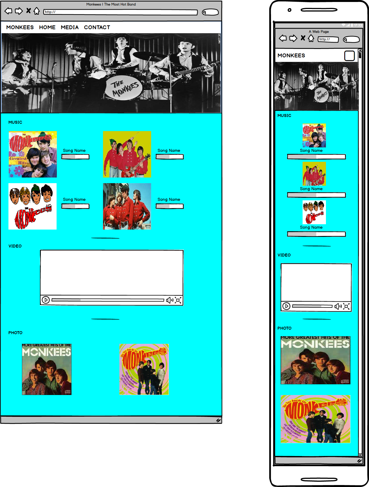

# MONKEE'S WEBPAGE
A site to show the music, video, & photo of the band called as **Monkee**

[Visit the webpage](https://wiiw337.github.io/monkeesbandweb/)
 

## UX

#### USER STORIES
As a fan of the band, he/she can pick 1 of the selection from the menu on top to:
- get more information of the band's member.
- know latest photo/music/video from the band.
- get detail about the latest event from the band.
- contact/hire the band for function like birthday party/wedding party.

#### Wireframe
The website wireframes were created by using **Balsamiq**.

Page 1 - **Home**

    

 
Page 2 - **Media**

    

Page 3 - **EVENT**

Page 3 was added after done in wireframe design. So, the page is using the same design with other pages, just different in <section> part.

Page 4 - **Contact**

    

## Features

#### **HOME** Page
Let the user to know more about the band's member info.

#### **MEDIA** Page
Let user to listen band's music, band's music video, & some of the band's photo.

#### **Event** Page
Let user know more details about coming events of the band such as Date & Place.

#### **CONTACT** Page
Let user to hire the band for perform in the party and list out some of the official social website such as facebook, instagram, & youtube to let fan follows.

## Technologies Used
Technologies i used on this website is listed as below:
- HTML5 - The body structure of website is wrote by HTML5
- CSS - The website is style by css
- jQuery - To make the navbar work 
- Popper.js - To make the navbar work
- Bootstrap - Grid system of bootstrap make the job don easily, & some useful classes from bootstrap also help alot.
- Google Fonts - To make the font on the website look more interesting & different in different section.
- Git - Allow me to store my code into Github.
 

## Testing
- The site was tested on Google Chrome browser.
- Tested with different device screen size like desktop, tablet, & phone, fit into the screen.
- Links in **HOME** page was tested & is work.
- Music & Video in **MEDIA** page also tested & is work too.
- Form in **CONTACT** page was tested by no enter any info or wrongly enter information, the form will notify user.
- Social media links in **CONTACT** page is tested & work. Browser will open a new tab for the social media website.
- Also tested by other user from community of slack. 

## Deployment
- The website is deploy by using **Github Pages**

## Credit

#### Content
- Member details were copied & link from [wikipedia](https://en.wikipedia.org)

#### Media
- All material like photos, musics, & videos were obtained from the milestone project 1 of code institute. (https://github.com/Code-Institute-Org/project-assets/tree/master/stream-1/band-assets)

