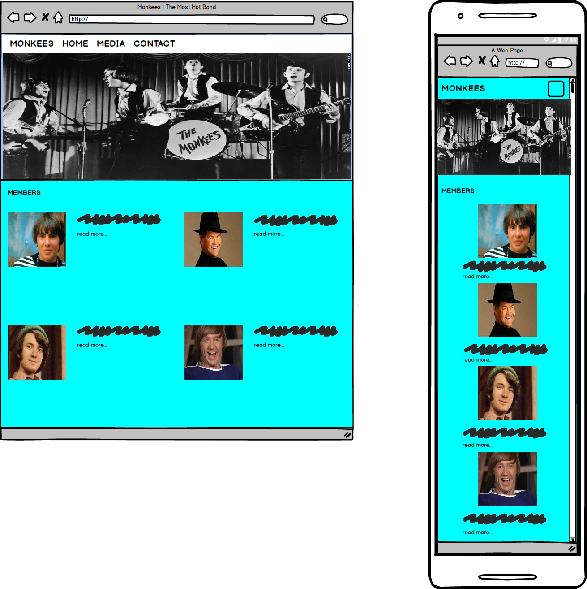
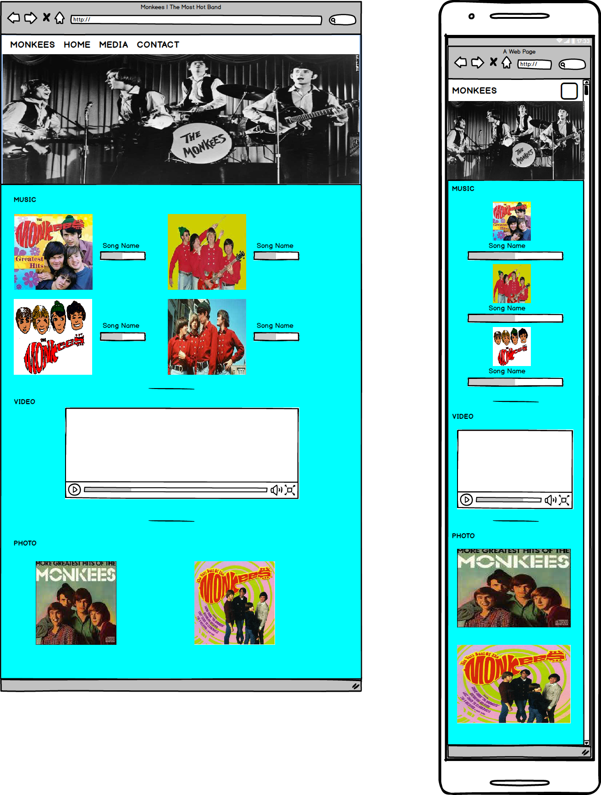
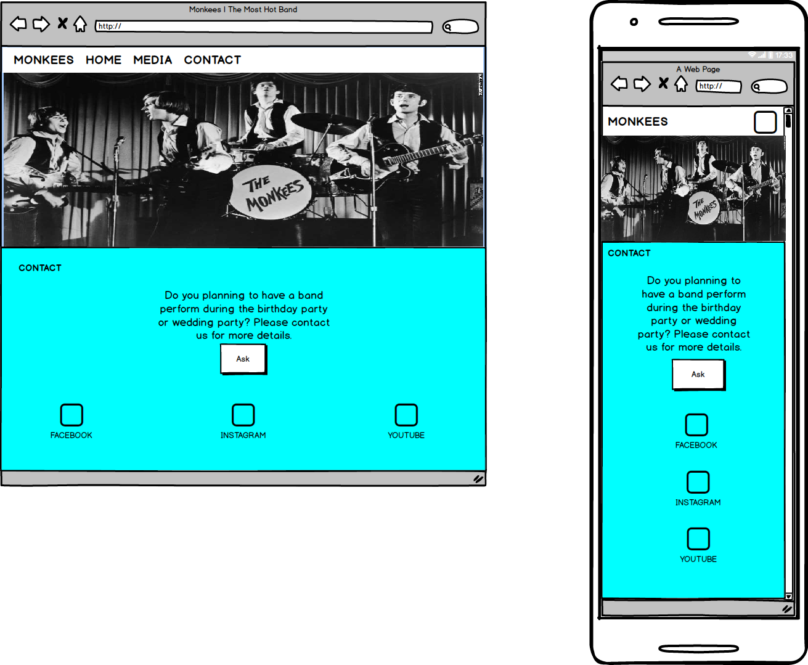

# MONKEE'S WEBPAGE
A site to show the music,video,photo of the band. 

[Visit the webpage](https://wiiw337.github.io/monkeesbandweb/)
 

## UX
The website wireframes were created by using **Balsamiq**. 

Page 1 - **Home**

    

 
Page 2 - **Media**

    

Page 3 - **EVENT**
Page 3 was added after done in wireframe design. So, the page is using the same design witht other pages, just different in <section> part.

Page 4 - **Contact**

    

I keep everything very simple & clean in design, so the user can easily to use the website.

## Features

#### **HOME** Page
Let the user to know more about the band's member info.

#### **MEDIA** Page
Let user to listen band's music, band's music video, & some of the band's photo.

#### **Event** Page
Let user know more details about coming events of the band such as Date & Place.

#### **CONTACT** Page
Let user to hire the band for perform in the party and list out some of the official social website such as facebook, instagram, & youtube to let fan follows.

## Technologies Used
Technologies i used on this website is listed as below:
- HTML
- CSS
- jQuery
- Popper.js
- Bootstrap
- Google Fonts
- Git
 

## Testing
- The site was tested on Google Chrome browser.
- Because of the grid system of bootstrap, the webpage is responsive to different screen size like desktop, tablet, mobile.
- Links in **HOME** page was tested & is work.
- Music & Video in **MEDIA** page also tested & is work too.
- Form in **CONTACT** page was tested by no enter any info or wrongly enter information, the form will notify user.

## Credit
- All material like photos, musics, & videos were obtained from the milestone project 1 of code institute.
- Member details were copied & link from [wikipedia](https://en.wikipedia.org)

